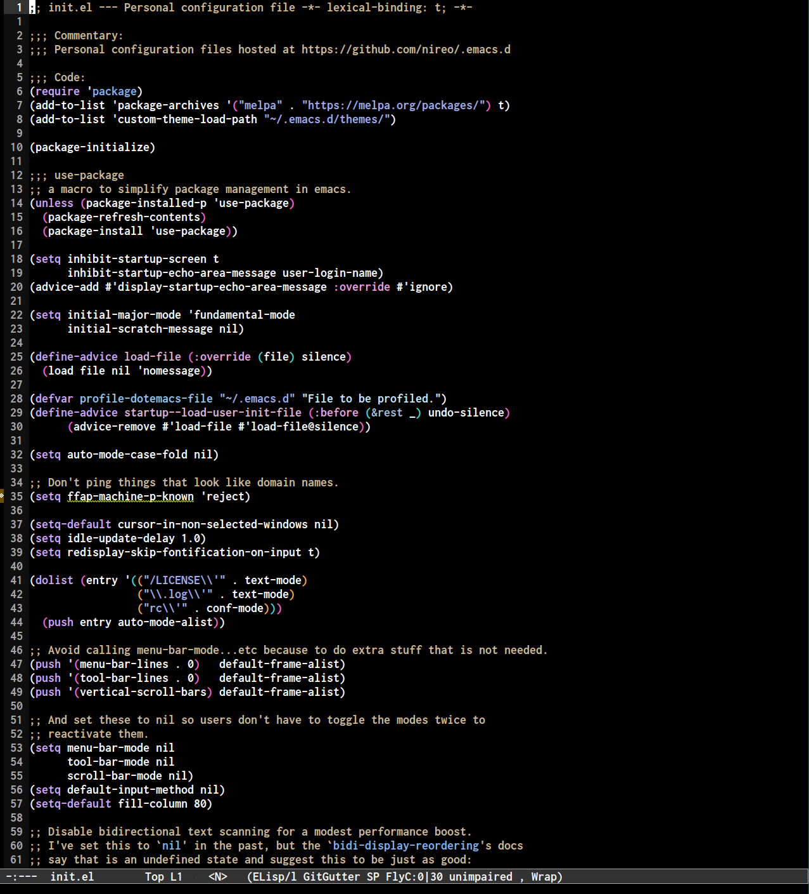

# emacs configuration

This is a emacs configuration with support for C++, Web development, Rust and Golang.

## Installation

```
rm -rf .emacs.d
git clone https://github.com/nireo/.emacs.d
```

## Screenshot


